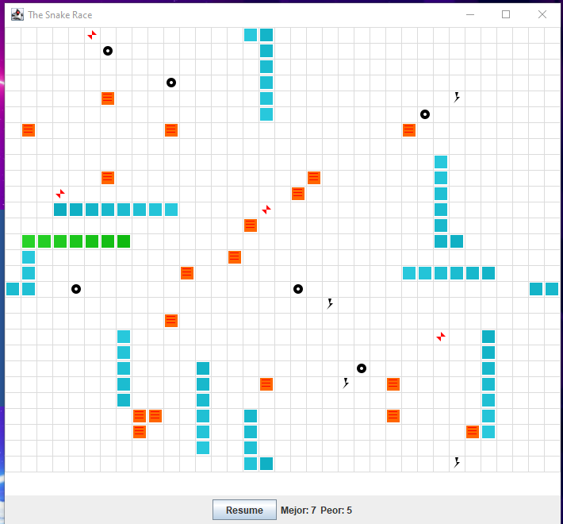
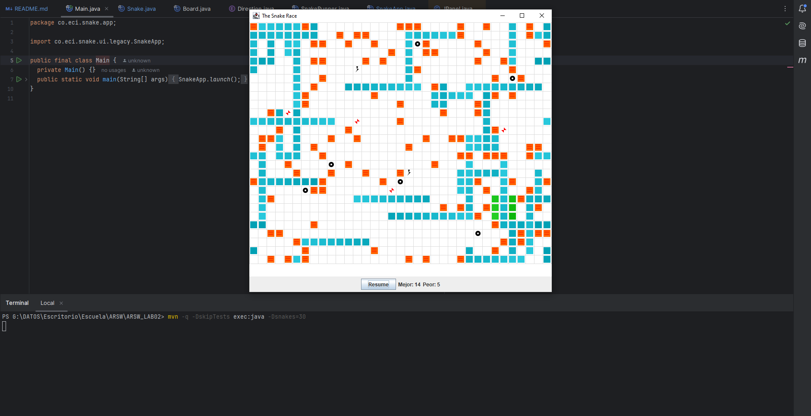

# Snake Race — ARSW Lab #2 (Java 21, Virtual Threads)

**Escuela Colombiana de Ingeniería – Arquitecturas de Software**  
Laboratorio de programación concurrente: condiciones de carrera, sincronización y colecciones seguras.

---

## Requisitos

- **JDK 21** (Temurin recomendado)
- **Maven 3.9+**
- SO: Windows, macOS o Linux

---

## Cómo ejecutar

```bash
mvn clean verify
mvn -q -DskipTests exec:java -Dsnakes=4
```

- `-Dsnakes=N` → inicia el juego con **N** serpientes (por defecto 2).
- **Controles**:
  - **Flechas**: serpiente **0** (Jugador 1).
  - **WASD**: serpiente **1** (si existe).
  - **Espacio** o botón **Action**: Pausar / Reanudar.

---

## Reglas del juego (resumen)

- **N serpientes** corren de forma autónoma (cada una en su propio hilo).
- **Ratones**: al comer uno, la serpiente **crece** y aparece un **nuevo obstáculo**.
- **Obstáculos**: si la cabeza entra en un obstáculo hay **rebote**.
- **Teletransportadores** (flechas rojas): entrar por uno te **saca por su par**.
- **Rayos (Turbo)**: al pisarlos, la serpiente obtiene **velocidad aumentada** temporal.
- Movimiento con **wrap-around** (el tablero “se repite” en los bordes).

---

## Arquitectura (carpetas)

```
co.eci.snake
├─ app/                 # Bootstrap de la aplicación (Main)
├─ core/                # Dominio: Board, Snake, Direction, Position
├─ core/engine/         # GameClock (ticks, Pausa/Reanudar)
├─ concurrency/         # SnakeRunner (lógica por serpiente con virtual threads)
└─ ui/legacy/           # UI estilo legado (Swing) con grilla y botón Action
```

---

# Actividades del laboratorio

## Parte I — (Calentamiento) `wait/notify` en un programa multi-hilo

1. Toma el programa [**PrimeFinder**](https://github.com/ARSW-ECI/wait-notify-excercise).
2. Modifícalo para que **cada _t_ milisegundos**:
   - Se **pausen** todos los hilos trabajadores.
   - Se **muestre** cuántos números primos se han encontrado.
   - El programa **espere ENTER** para **reanudar**.
3. La sincronización debe usar **`synchronized`**, **`wait()`**, **`notify()` / `notifyAll()`** sobre el **mismo monitor** (sin _busy-waiting_).
4. Entrega en el reporte de laboratorio **las observaciones y/o comentarios** explicando tu diseño de sincronización (qué lock, qué condición, cómo evitas _lost wakeups_).

> Objetivo didáctico: practicar suspensión/continuación **sin** espera activa y consolidar el modelo de monitores en Java.

**Reporte de laboratorio**
1. Data races encontradas y su solución.
  - Al revisar el codigo nos encontramos que hay condiciones de carrera al leer los primos, porque mientras se leen puede que tambien se escriban. Para solucionar esto utilizamos un lock llamado primesLock que se comprueba antes de retornar el valor de primes en getprimes().

2. Colecciones mal usadas y cómo se protegieron (o sustituyeron).
  - Se identifico el uso de LinkedList, que no es thread-safe. Se protegióo mediante sincronizacion con `primesLock` en todas las operaciones de lectura/escritura. Adicionalmente, getPrimes() retorna una copia defensiva para evitar que modificaciones externas afecten la lista original.

3. Esperas activas eliminadas y mecanismo utilizado.
  - Se evito el uso de espera activa (busy-waiting) mediante el patron wait/notify. Cuando un hilo debe pausarse, no verifica continuamente una bandera consumiendo CPU, sino que usa `pauseLock.wait()` para suspenderse hasta que otro hilo llame a `pauseLock.notifyAll()`. Esto libera recursos del procesador mientras los hilos están pausados.

4. Regiones críticas definidas y justificación de su **alcance mínimo**.
  - Se definieron 3 regiones críticas:
  
    - Pausa/reanudacion (pauseLock):
       - Alcance: Solo el bloque while(paused) con wait()
       - Justificación: Excluye isPrime() e I/O (println) del lock. Solo protege la verificacion y espera de pausa.
    
    - Escritura de primos (primesLock):
       - Alcance: Solo primes.add(i)
       - Justificación: isPrime() está fuera del lock (es calculo puro sin estado compartido). println() esta fuera para no bloquear otros hilos durante I/O.
    
    - Lectura de primos (primesLock):
       - Alcance: Solo la creacion de la copia defensiva
       - Justificación: Retorna una copia para que el hilo llamador pueda iterar sin mantener el lock, minimizando contencion.

> Observacion: El programa falla si la tecla que se oprime no es Enter.
---

## Parte II — SnakeRace concurrente (núcleo del laboratorio)

### 1) Análisis de concurrencia

- Explica **cómo** el código usa hilos para dar autonomía a cada serpiente.

  Encontramos que el codigo implementa hilos de las siguientes manera:

  En este proyecto cada serpiente se mueve sola usando hilos esto se hace con la clase SnakeRunner que implementa Runnable, así cada serpiente tiene su propio hilo y pueden moverse casi al mismo tiempo sin depender de las otras

  Dentro del método run() hay un ciclo infinito la serpiente puede girar luego intenta avanzar en el tablero revisa si comió algo y después se detiene un momento con Thread.sleep(), ese sleep sirve para controlar la velocidad y también para que el hilo no use CPU sin necesidad

  El juego tiene un reloj central llamado GameClock este usa un ScheduledExecutorService para ejecutar una acción llamada tick solo cuando el juego está en estado RUNNING, el estado se guarda en un AtomicReference lo que permite cambiar entre RUNNING PAUSED y STOPPED de forma segura entre hilos


- **Identifica** y documenta en **`el reporte de laboratorio`**:
  - Posibles **condiciones de carrera**.

    Aunque el tablero está protegido con synchronized en el método step igual pueden aparecer problemas de concurrencia porque solo una serpiente puede moverse a la vez entonces se evita dañar los datos pero se pierde mucho paralelismo y si hay muchas serpientes todas tienen que esperar su turno lo que puede volver el juego más lento además la clase Snake también es delicada porque su cuerpo usa un ArrayDeque que no es thread safe y los métodos que leen o modifican ese cuerpo como advance snapshot y head no están sincronizados entonces si otro hilo como el de la interfaz gráfica intenta leer la serpiente mientras se mueve pueden aparecer lecturas inconsistentes estados raros o errores de concurrencia aunque la dirección es un poco más segura porque está marcada como volatile y eso sí garantiza visibilidad entre hilos

  - **Colecciones** o estructuras **no seguras** en contexto concurrente.

    En Snake:
    - ArrayDeque que es no thread-safe.
    - Accesos sin sincronizació
  
    En Board:
    - HashSet y HashMap tampoco son thread-safe.
    - Sin embargo, aquí están protegidos indirectamente porque los métodos que los usan están sincronizados.
    - Esto los vuelve seguros, pero a costa de rendimient

  - Ocurrencias de **espera activa** (busy-wait) o de sincronización innecesaria.

    En este código realmente no hay busy wait y eso es bueno porque las serpientes no se quedan en un ciclo gastando CPU sino que usan Thread.sleep() que es una espera bloqueante y más eficiente pero donde sí puede haber problema es en la sincronización del tablero ya que el synchronized en todo el método step() hace que el movimiento de las serpientes sea casi secuencial entonces aunque se evita dañar los datos también se pierde mucha concurrencia real en cambio el GameClock está mejor diseñado porque usa ScheduledExecutorService y AtomicReference lo que permite controlar el estado del juego de forma segura sin bloqueos pesados ni esperas innecesarias

### 2) Correcciones mínimas y regiones críticas

- **Elimina** esperas activas reemplazándolas por **señales** / **estados** o mecanismos de la librería de concurrencia.

  En SnakeRunner.run() hay un ciclo infinito que solo se detiene si el hilo es interrumpido.
  Aunque usa Thread.sleep() y no es un busy wait puro, la serpiente sigue ejecutándose incluso si el juego está en pausa o detenido, porque no consulta el GameState.

  El riesgo es que los hilos siguen activos sin necesidad y pueden consumir recursos cuando el juego debería estar detenido para solucionarlo podemos Hacer que SnakeRunner consulte el estado del juego por ejemplo el GameClock o una referencia compartida de GameState y si está en PAUSED esperar con wait() y si está en STOPPED entonces terminar el hilo.

- Protege **solo** las **regiones críticas estrictamente necesarias** (evita bloqueos amplios).

  En Board.step(Snake snake) el método completo está marcado como:

  public synchronized MoveResult step(Snake snake)

  Esto bloquea todo el movimiento del tablero entonces solo una serpiente puede moverse a la vez, no hay corrupción de datos pero sí perdida fuerte de paralelismo y rendimiento para mejorarlo podemos quitar el synchronized del método completo y sincronizar solo las partes donde se modifican colecciones compartidas por ejemplo:

  - Eliminación de ratón o turbo
  - Creación de nuevos elementos
  - Acceso a teleports

  así varias serpientes pueden calcular su movimiento en paralelo y solo se bloquean cuando realmente escriben en el tablero

- Justifica en **`el reporte de laboratorio`** cada cambio: cuál era el riesgo y cómo lo resuelves.

  En la clase snake en la linea: 

  private final Deque<Position> body = new ArrayDeque();

  Los metodos advance(), head() y snapshot() no tienen sincronización si otro hilo por ejemplo la GUI lee la serpiente mientras se mueve pueden aparecer lecturas inconsistentes o errores de concurrencia por lo que se tienen que sincronizar.

### 3) Control de ejecución seguro (UI)

- Implementa la **UI** con **Iniciar / Pausar / Reanudar** (ya existe el botón _Action_ y el reloj `GameClock`).
- Al **Pausar**, muestra de forma **consistente** (sin _tearing_):
  - La **serpiente viva más larga**.
  - La **peor serpiente** (la que **primero murió**).
- Considera que la suspensión **no es instantánea**; coordina para que el estado mostrado no quede “a medias”.
  


### 4) Robustez bajo carga

- Ejecuta con **N alto** (`-Dsnakes=20` o más) y/o aumenta la velocidad.
- El juego **no debe romperse**: sin `ConcurrentModificationException`, sin lecturas inconsistentes, sin _deadlocks_.
- Si habilitas **teleports** y **turbo**, verifica que las reglas no introduzcan carreras.

  

  Como se muestra en la imagen con un -Dsnakes=30 despues de unos minutos se sigue ejecutando sin error ninguno 


> Entregables detallados más abajo.

---

## Entregables

1. **Código fuente** funcionando en **Java 21**.
2. Todo de manera clara en **`**el reporte de laboratorio**`** con:
   - Data races encontradas y su solución.
   - Colecciones mal usadas y cómo se protegieron (o sustituyeron).
   - Esperas activas eliminadas y mecanismo utilizado.
   - Regiones críticas definidas y justificación de su **alcance mínimo**.
3. UI con **Iniciar / Pausar / Reanudar** y estadísticas solicitadas al pausar.

---

## Criterios de evaluación (10)

- (3) **Concurrencia correcta**: sin data races; sincronización bien localizada.
- (2) **Pausa/Reanudar**: consistencia visual y de estado.
- (2) **Robustez**: corre **con N alto** y sin excepciones de concurrencia.
- (1.5) **Calidad**: estructura clara, nombres, comentarios; sin _code smells_ obvios.
- (1.5) **Documentación**: **`reporte de laboratorio`** claro, reproducible;

---

## Tips y configuración útil

- **Número de serpientes**: `-Dsnakes=N` al ejecutar.
- **Tamaño del tablero**: cambiar el constructor `new Board(width, height)`.
- **Teleports / Turbo**: editar `Board.java` (métodos de inicialización y reglas en `step(...)`).
- **Velocidad**: ajustar `GameClock` (tick) o el `sleep` del `SnakeRunner` (incluye modo turbo).

---

## Cómo correr pruebas

```bash
mvn clean verify
```

Incluye compilación y ejecución de pruebas JUnit. Si tienes análisis estático, ejecútalo en `verify` o `site` según tu `pom.xml`.

---

## Créditos

Este laboratorio es una adaptación modernizada del ejercicio **SnakeRace** de ARSW. El enunciado de actividades se conserva para mantener los objetivos pedagógicos del curso.

**Base construida por el Ing. Javier Toquica.**
